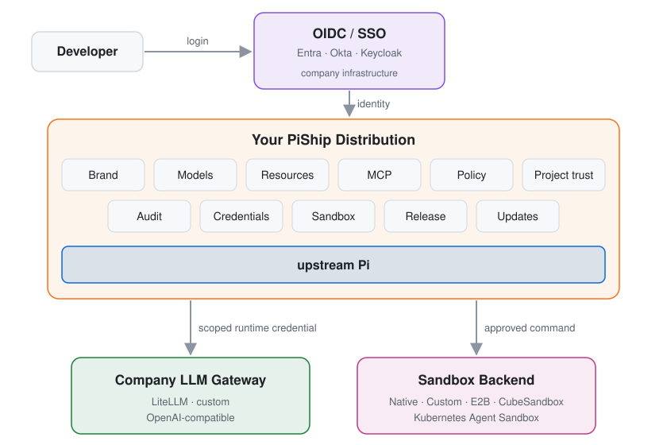
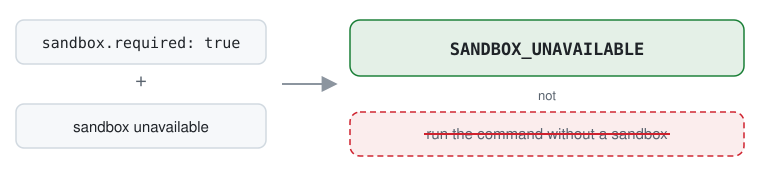
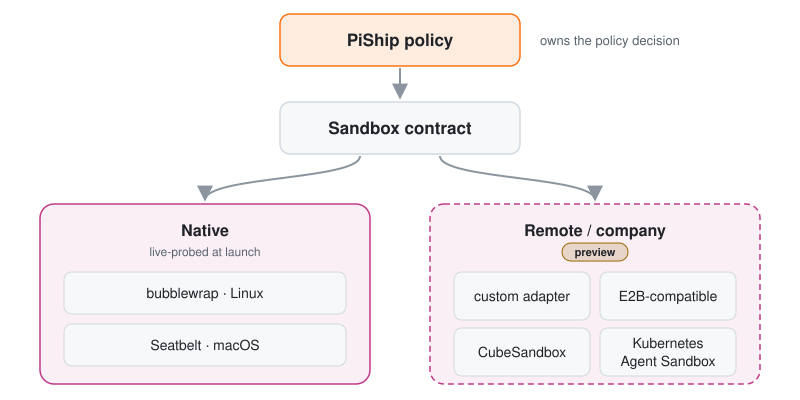

# PiShip

<p align="center">
  <strong>Turn upstream Pi into your company's coding agent — without forking Pi.</strong>
</p>

<p align="center">
  Bring your identity, LLM gateway, policy, sandbox, resources, and release process.<br>
  Pi stays upstream. You own the distribution.
</p>

<p align="center">
  
  
  =22.19.0">
  
</p>

<p align="center">
  
</p>

<p align="center">
  <a href="#why-piship">Why PiShip?</a> ·
  <a href="#how-it-works">How it works</a> ·
  <a href="#quickstart">Quickstart</a> ·
  <a href="#bring-your-own-sandbox">Sandbox</a> ·
  <a href="#project-status">Status</a> ·
  <a href="#documentation">Docs</a>
</p>

---

## Pi, shipped your way

PiShip is an open-source **distribution and governance layer for Pi**.

It does not replace Pi and it does not fork Pi. Pi continues to own the agent loop, tools, sessions, TUI, and model runtime.

PiShip owns everything around it that turns an upstream coding agent into something an organization can actually distribute:

<p align="center">
  
</p>

Your company keeps its existing infrastructure.

PiShip plugs it into Pi.

**Bring your own identity. Bring your own gateway. Bring your own sandbox.**

---

## Why PiShip?

| Problem | PiShip |
| --- | --- |
| You want to customize Pi without maintaining a fork | Pi stays upstream and pinned; PiShip owns the distribution layer |
| Developers should not carry upstream provider keys | Sign in through company OIDC and receive a scoped runtime credential for your gateway |
| Different users should not get arbitrary models and tools | Declare models, resources, MCP servers, capabilities, and policy in one distribution |
| Agent commands need containment | Use bubblewrap, Seatbelt, your own sandbox, E2B-compatible infrastructure, CubeSandbox, or Kubernetes Agent Sandbox |
| Company policy must survive project and user configuration | Managed policy is layered and downstream configuration can only narrow what the company allows |
| You need to know what is actually enforced | `doctor`, `policy explain`, `config explain`, and `capabilities` show effective runtime state |
| Shipping an internal agent should be reproducible | PiShip pins Pi and dependencies and builds versioned distribution artifacts |
| Updates need a trust boundary | Signed channels, verified update, rollback, SBOM, notices, checksums, and vulnerability gates |

PiShip is not an identity provider, LLM gateway, or sandbox service.

It is the layer that connects those systems to a Pi-based coding agent under one reproducible distribution contract.

---

## How it works

<p align="center">
  
</p>

A typical managed flow is:

<p align="center">
  
</p>

The identity token goes to the credential broker. The gateway receives the scoped runtime credential. Upstream provider credentials do not need to be distributed to developer machines.

See the [enterprise integration contract](docs/enterprise-integration.md) for the exact wire protocols.

---

## What you control

A PiShip distribution can define the parts of Pi that should be consistent across an organization.

| Area | Examples |
| --- | --- |
| **Identity** | OIDC Authorization Code + PKCE |
| **LLM access** | OpenAI-compatible company gateway |
| **Credentials** | Broker-issued short-lived runtime credentials |
| **Models** | Default model, allowlist, capability metadata |
| **Resources** | Instructions, skills, extensions, prompts, themes |
| **Policy** | Tools, filesystem, shell, MCP, resources, providers |
| **Project trust** | Different behavior for company, external, and unknown repositories |
| **MCP** | Declared servers, tool allowlists, expected server identity |
| **Sandbox** | Native, custom, E2B-compatible, CubeSandbox, Kubernetes Agent Sandbox |
| **Audit** | Metadata-first policy and runtime events |
| **Release** | Reproducible artifacts, SBOM, notices, vulnerability gates |
| **Updates** | Signed channels, verification, atomic activation, rollback |

The distribution is declarative.

A complete managed manifest, valid on its own (`piship validate` accepts it as is):

```yaml
schema: piship/v1alpha4

app:
  id: acmecode
  name: AcmeCode
  command: acmecode
  version: 1.0.0

runtime:
  pi: "0.87.1"

deployment:
  mode: managed

# Endpoints are resolved from the environment at launch.
variables:
  - ACMECODE_OIDC_ISSUER
  - ACMECODE_OIDC_CLIENT_ID
  - ACMECODE_CREDENTIAL_BROKER_URL
  - ACMECODE_LLM_GATEWAY_URL

identity:
  mode: oidc
  oidc:
    issuer: ${ACMECODE_OIDC_ISSUER}
    clientId: ${ACMECODE_OIDC_CLIENT_ID}
    flow: authorization_code_pkce
    redirectUri: http://127.0.0.1:8765/callback

credential:
  provider: http-broker
  broker:
    endpoint: ${ACMECODE_CREDENTIAL_BROKER_URL}

inference:
  provider: openai-compatible
  baseUrl: ${ACMECODE_LLM_GATEWAY_URL}

models:
  default: acme/coder
  allowed:
    - acme/coder
    - acme/general
  catalog:
    acme/coder:
      name: Acme Coder
      contextWindow: 128000
      maxOutputTokens: 8192
      tools: true
    acme/general:
      name: Acme General
      contextWindow: 128000
      maxOutputTokens: 8192

network:
  publicFallback: deny

sandbox:
  required: true
  network:
    mode: deny

updates:
  channel: stable
  channels: [stable]
  rollback: true
```

The manifest contains configuration, not company secrets. Runtime endpoints are resolved at launch and credentials are stored separately.

Everything else (policy, resources, MCP servers, audit sinks, release gates) is optional and has defaults; the [manifest reference](docs/manifest.md) lists every field, and the [demo company manifest](examples/demo-company/piship.yaml) uses most of them.

---

## Quickstart

PiShip is currently built from source.

Requirements:

**Node.js 22.19.0 or newer.**

The managed demo also needs an OS sandbox (Seatbelt on macOS, or bubblewrap with unprivileged user namespaces on Linux) and a platform secret store (macOS Keychain, Linux Secret Service, or Windows Credential Manager). [Troubleshooting](docs/troubleshooting.md) lists the prerequisites and every PiShip error code with what to do.

Clone the repository and build it:

```bash
git clone https://github.com/tc3oliver/piship.git
cd piship
npm ci
npm run build
```

Run the CLI from the repository root as `node packages/cli/dist/bin.js`. It is not published to npm, so `npm exec` and `npx` would look up `piship` on the public registry instead.

### Try a company distribution

The repository includes **AcmeCode**, a deterministic local demo of a managed company distribution.

It provides local fixtures for:

```text
OIDC provider
credential broker
LLM gateway
```

Start them:

```bash
node examples/demo-company/fixtures/local-services.mjs
```

The fixture prints the required `ACMECODE_*` environment variables.

In another terminal, export those values and build the distribution:

```bash
node packages/cli/dist/bin.js build examples/demo-company/piship.yaml

node dist/acmecode/piship.mjs install dist/acmecode

~/.local/bin/acmecode login
~/.local/bin/acmecode
```

You now have a branded Pi distribution with managed identity, model access, governance, sandbox policy, resources, MCP, diagnostics, and release configuration.

Useful commands:

```bash
acmecode doctor
acmecode models
acmecode capabilities

acmecode config explain

acmecode policy explain shell.execute "git status"
acmecode policy explain filesystem.read ~/.ssh/id_ed25519
```

To remove it, sign out first: `logout` revokes the runtime credential at the broker, and purge revokes nothing, so it refuses while you are signed in.

```bash
acmecode logout
node dist/acmecode/piship.mjs uninstall acmecode --purge --yes
```

The local services are deterministic test fixtures, not evidence of a live company integration.

See the full [company demo walkthrough](examples/demo-company/README.md).

### Start your own distribution

`piship init` writes a new distribution directory: a `piship.yaml` and a `resources/AGENTS.md` to edit. Keep it in a repository of your own, not inside the PiShip clone, and run the CLI by path ([running the CLI from your own repository](docs/enterprise-integration.md#running-the-cli-from-your-own-repository)):

```bash
node ~/src/piship/packages/cli/dist/bin.js init ./my-agent              # personal: Pi-native providers and auth
node ~/src/piship/packages/cli/dist/bin.js init ./my-agent --managed    # managed: OIDC, credential broker, gateway

# edit my-agent/piship.yaml and my-agent/resources/AGENTS.md, then:
node ~/src/piship/packages/cli/dist/bin.js validate ./my-agent/piship.yaml
node ~/src/piship/packages/cli/dist/bin.js lock ./my-agent/piship.yaml
node ~/src/piship/packages/cli/dist/bin.js build ./my-agent/piship.yaml
node dist/my-agent/piship.mjs install dist/my-agent
```

Commit `piship.yaml`, `piship.lock`, and `resources/`; never a secret. A managed template needs your identity provider, broker, and gateway ([enterprise integration](docs/enterprise-integration.md)); to ship releases and updates to other people, follow the [release guide](docs/release.md).

---

## Governance that fails closed

PiShip does not treat configuration as documentation.

The runtime checks it.

A managed distribution can control resource loading, tools, filesystem access, shell commands, MCP servers and tools, project trust, model selection, and supported capabilities before the corresponding action occurs.

When a required enforcement mechanism cannot be activated, PiShip does not silently downgrade to unrestricted execution.

For example:

<p align="center">
  
</p>

Effective state is inspectable:

```bash
acmecode doctor
acmecode capabilities
acmecode config explain
acmecode policy explain shell.execute "npm test"
```

See [governance and security](docs/security.md#governance).

---

## Bring your own sandbox

PiShip owns the **policy decision**.

The sandbox backend owns **execution isolation**.

<p align="center">
  
</p>

Native sandboxing is live-probed at launch.

PiShip's boundary tests cover denied reads, writes outside the allowlist, network isolation, environment filtering, git control files, process-tree cleanup, and macOS launchd escape cases.

Remote sandbox backends use the same contract but are currently a **preview** and have not yet been qualified against live E2B, CubeSandbox, Kubernetes Agent Sandbox, or company infrastructure.

Read the full [sandbox contract](docs/sandbox.md).

---

## Your infrastructure stays yours

PiShip is designed around existing company infrastructure rather than replacing it.

| Your organization provides | PiShip provides |
| --- | --- |
| OIDC / SSO | Authorization Code + PKCE client integration |
| Identity and group policy | Identity lifecycle and broker exchange |
| Credential service | Credential storage, refresh, revoke lifecycle |
| LLM gateway | Model governance and Pi runtime binding |
| Enterprise CA / proxy | TLS and network policy integration |
| Sandbox infrastructure | Sandbox backend contract |
| Internal resources | Distribution packaging and trust classification |
| Release policy | Reproducible release and signed update machinery |

A LiteLLM-based gateway is one possible starting point; PiShip only requires the documented integration contracts.

Read [enterprise integration](docs/enterprise-integration.md).

---

## Company-first, not company-only

PiShip can also build personal Pi distributions.

Personal mode does not require:

```text
Company IdP
Credential broker
Company gateway
Audit service
Private network
```

You can still use the same distribution machinery to pin Pi, isolate its state, package your own instructions, skills, extensions, prompts and themes, declare MCP servers, and create reproducible releases.

The included **MyPi** example keeps its state separate from `~/.pi` and can use Pi-native authentication or a local OpenAI-compatible endpoint.

```bash
node packages/cli/dist/bin.js build examples/personal/piship.yaml

node dist/mypi/piship.mjs install dist/mypi

~/.local/bin/mypi
```

See the [personal distribution example](examples/personal/README.md).

---

## Pi stays upstream

PiShip deliberately has a narrow ownership boundary.

| Upstream Pi owns | PiShip owns |
| --- | --- |
| Agent loop | Distribution manifest |
| Model runtime | Pi version pinning |
| Built-in tools | Identity integration |
| Sessions | Credential lifecycle |
| TUI | LLM gateway binding |
| Core coding behavior | Model governance |
| Provider implementations | Resources and trust |
|  | Policy |
|  | MCP governance |
|  | Sandbox integration |
|  | Audit |
|  | Build and install |
|  | Release, update, rollback |

This is the core design rule:

> **Own the distribution, not the agent.**

It keeps PiShip focused and lets Pi evolve upstream without turning every company customization into a permanent fork.

---

## Release and update

PiShip can turn a locked distribution into one artifact per target with:

```text
Pinned runtime
Exact dependency inputs
Release metadata
SPDX SBOM
Third-party notices
Vulnerability scan result
Checksums
```

A release can then be published through signed `stable`, `candidate`, or `dev` channels.

Installed distributions support verified update and rollback while preserving user sessions and settings. Credentials are not snapshotted into rollback state.

```bash
piship release piship.yaml

piship verify-release <artifact>

piship sign-channel <channel-dir> <artifact> \
  --channel stable \
  --key <private-key> \
  --key-id <key-id>
```

Users update through the branded command:

```bash
acmecode update --check
acmecode update
acmecode rollback
```

See the [release documentation](docs/release.md).

---

## Project status

**PiShip is pre-release.**

v0.7.1 is the [production-validation baseline](docs/status.md#v071-production-validation-baseline): the version a production consumer pins (tag `v0.7.1`, commit `bd4bc09`) and installs from its [GitHub pre-release](https://github.com/tc3oliver/piship/releases/tag/v0.7.1), six attested example release archives from a passing Release qualification run. v0.7.0 is an earlier [GitHub pre-release](https://github.com/tc3oliver/piship/releases/tag/v0.7.0). Nothing is published to npm, and the project operates no signed update channel: key custody and channels belong to each distribution owner.

The portable personal distribution core is the most mature surface. Managed access, governance, and release lifecycle are currently compatibility candidates. Sandbox maturity is reported per backend: the native Linux (bubblewrap) and macOS (Seatbelt) sandboxes are candidates, native Windows is unavailable, and the `custom`, `e2b-compatible`, and `kubernetes-agent-sandbox` backends are preview functionality ([per-backend table](docs/status.md#sandbox-backends)).

Many integration paths are tested with deterministic local fixtures. The [enterprise reference stack](examples/enterprise-reference/README.md) (Keycloak, a reference credential broker, LiteLLM in front of a mock model, and a reference container sandbox) runs the managed flow against real services of those kinds on Ubuntu in the nightly and manual Reference E2E; it stands in for a company's services and is not one.

There is manual real-provider evidence for the reference stack: the maintainer-dispatched `Live provider` workflow sent a model request from the AcmeCode reference distribution through the reference LiteLLM to a real upstream provider, and [run 36877709332](https://github.com/tc3oliver/piship/actions/runs/36877709332) passed ([status](docs/status.md#after-v071-on-main)). The project does **not** yet claim validation against a real company IdP or company gateway in production, nor live qualification against an E2B deployment, CubeSandbox deployment, or Kubernetes Agent Sandbox cluster.

The [project status page](docs/status.md) is the source of truth for current support and the evidence behind each claim.

---

## Platform support

Current targets are:

| Platform | Distribution | Native sandbox |
| --- | --- | --- |
| Linux x64 | Yes | bubblewrap |
| macOS arm64 | Yes | Seatbelt |
| Windows x64 | Yes | Not currently available |

A Windows distribution that requires a sandbox therefore fails closed unless it uses a remote sandbox backend.

Node.js 22.19.0 or newer is required.

See [compatibility](docs/compatibility.md).

---

## Documentation

| Topic | Document |
| --- | --- |
| What works today | [Project status](docs/status.md) |
| System design | [Architecture](docs/architecture.md) |
| Distribution configuration | [Manifest](docs/manifest.md) |
| Company infrastructure integration | [Enterprise integration](docs/enterprise-integration.md) |
| Identity | [Identity](docs/identity.md) |
| Credentials | [Credentials](docs/credentials.md) |
| LLM gateway and models | [Inference](docs/inference.md) |
| Policy and security boundaries | [Security](docs/security.md) |
| Sandbox backends | [Sandbox](docs/sandbox.md) |
| Writing and testing adapters | [Adapter SDK](docs/adapter-sdk.md) |
| Release, update, rollback | [Release](docs/release.md) |
| Pi compatibility | [Compatibility](docs/compatibility.md) |
| Prerequisites and error codes | [Troubleshooting](docs/troubleshooting.md) |
| Future direction | [Roadmap](docs/roadmap.md) |
| Architecture decisions | [Decisions](docs/decisions.md) |

---

## Development

Run the full local gate:

```bash
npm run check
npm run test:compatibility
```

The repository uses separate CI evidence tiers for merge safety, installed cross-platform qualification, and release-candidate qualification.

See [project status](docs/status.md) for the current evidence.

---

## Security

PiShip's security model and known limits are documented explicitly in [docs/security.md](docs/security.md).

Security reports should follow [SECURITY.md](SECURITY.md).

---

## Contributing

Contributions are welcome.

See [CONTRIBUTING.md](CONTRIBUTING.md).

---

## License

MIT
