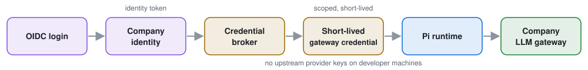
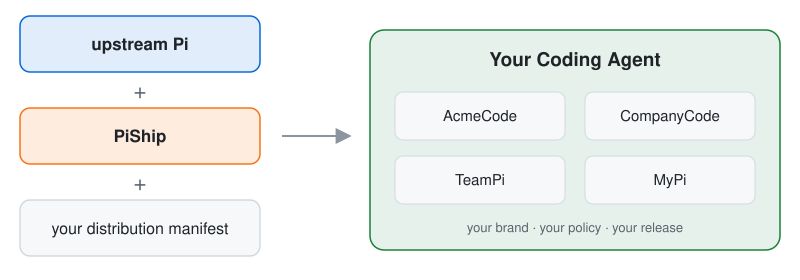

<h1 align="center">PiShip</h1>

<p align="center">
  <strong>Ship Pi as your company's own coding agent. No fork.</strong>
</p>

<p align="center">
  English · <a href="README.zh-TW.md">繁體中文</a>
</p>

<p align="center">
  
  
  =22.19.0">
  
</p>

<p align="center">
  
</p>

Your developers want [Pi](https://github.com/earendil-works/pi). Your security team wants single sign-on, no provider API keys on laptops, a sandbox around every command the agent runs, and a record of what it did.

You can fork Pi, build all of that in, and merge upstream every week for as long as you use it. Or you can write one `piship.yaml` and get a command like `acmecode` that your developers install and run. Pi stays upstream and untouched.

## Fork vs. PiShip

| | Forking Pi | PiShip |
| --- | --- | --- |
| A new Pi release | Merge it into your fork | Bump the pin, run the compatibility tests |
| Sign-in | Build it | OIDC with PKCE, configured in YAML |
| Provider keys | On every laptop, or build a proxy | Stay in your gateway; laptops get a short-lived credential |
| Which models people can use | Patch the code | An allowlist in the manifest |
| Sandbox | Build it | bubblewrap, Seatbelt, or your remote sandbox |
| Rules for tools, files, shell, MCP | Build it | Declared, enforced, and explainable |
| Getting it onto 500 laptops | Your own build and update tooling | Signed releases, verified updates, rollback |

## What you get

- **Your brand, your command.** `acmecode`, `teampi`, whatever you call it, with your instructions, skills, extensions, prompts, and themes built in.
- **Company sign-in.** Developers log in with SSO. PiShip trades that identity at your credential broker for a short-lived gateway credential, keeps it in the OS keychain, renews it, and revokes it on logout.
- **Your gateway, your models.** Requests go to your OpenAI-compatible gateway (LiteLLM works) and only to the models you allow.
- **Policy that actually runs.** Tool calls, file access, shell commands, and MCP tools are checked before they happen. `acmecode policy explain` tells you why.
- **A sandbox, or nothing runs.** If you require one and it is not there, the command does not run on the host. No silent fallback.
- **Releases you can trust.** Reproducible builds per platform with an SBOM, license notices, a vulnerability gate, signed update channels, and one-command rollback.

PiShip does not replace your identity provider, gateway, or sandbox. It connects the ones you already have to Pi.

<p align="center">
  
</p>

## Try it in two minutes

You need Node.js 22.19.0 or newer. On Linux the demo also needs bubblewrap with unprivileged user namespaces; macOS has its sandbox built in.

```bash
git clone https://github.com/tc3oliver/piship.git
cd piship && npm ci && npm run build

# Terminal 1: a fake company (OIDC provider, credential broker, LLM gateway)
node examples/demo-company/fixtures/local-services.mjs
```

It prints a few `ACMECODE_*` variables. Export them in a second terminal, then build, install, and sign in:

```bash
node packages/cli/dist/bin.js build examples/demo-company/piship.yaml
node dist/acmecode/piship.mjs install dist/acmecode
~/.local/bin/acmecode login
~/.local/bin/acmecode
```

That is a branded Pi with company sign-in, a governed model list, policy, and a sandbox. Poke at it (with `~/.local/bin` on your `PATH`):

```bash
acmecode doctor                                             # what is actually in force
acmecode policy explain filesystem.read ~/.ssh/id_ed25519   # allowed? which rule decided?
acmecode policy explain shell.execute "git status"
```

Clean up with `acmecode logout`, then `node dist/acmecode/piship.mjs uninstall acmecode --purge --yes`.

The CLI is not on npm, so run it as `node packages/cli/dist/bin.js`; `npx` and `npm exec` would look it up on the public registry instead. If something fails, [troubleshooting](docs/troubleshooting.md) lists every error code and what to do. The full walkthrough is in the [company demo](examples/demo-company/README.md).

## Set it up with your coding agent

Paste this into Claude Code, Codex, Pi, or any coding agent that can run commands. It asks you a few questions, then writes, builds, and checks your distribution.

```text
Set up a PiShip distribution for me. PiShip (https://github.com/tc3oliver/piship)
builds a branded coding agent on top of upstream Pi.

1. Clone https://github.com/tc3oliver/piship to ~/src/piship (ask me first if I
   want it elsewhere), run `npm ci && npm run build` there, then read
   docs/agent-setup.md in that clone and follow it step by step.
2. Ask me the questions it lists before you write anything. Never guess a URL,
   client ID, or model name.
3. Never put a secret in a file, a command, or your reply, and do not touch ~/.pi.
4. Ask me before you install anything into ~/.local/bin.
```

The steps it follows are in [docs/agent-setup.md](docs/agent-setup.md), so you can read exactly what it will do first.

## One file

A minimal managed distribution. `piship validate` accepts it as is; the demo's own manifest adds policy, resources, MCP, and audit on top.

<details>
<summary><b>Show piship.yaml</b></summary>

```yaml
schema: piship/v1alpha5

app:
  id: acmecode
  name: AcmeCode
  command: acmecode
  version: 1.0.0

runtime:
  pi: "1.0.0"

deployment:
  mode: managed

# Endpoints are resolved from the environment at launch.
variables:
  - ACMECODE_OIDC_ISSUER
  - ACMECODE_OIDC_CLIENT_ID
  - ACMECODE_CREDENTIAL_BROKER_URL
  - ACMECODE_LLM_GATEWAY_URL

identity:
  mode: oidc
  oidc:
    issuer: ${ACMECODE_OIDC_ISSUER}
    clientId: ${ACMECODE_OIDC_CLIENT_ID}
    flow: authorization_code_pkce
    redirectUri: http://127.0.0.1:8765/callback

credential:
  provider: http-broker
  broker:
    endpoint: ${ACMECODE_CREDENTIAL_BROKER_URL}

inference:
  provider: openai-compatible
  baseUrl: ${ACMECODE_LLM_GATEWAY_URL}

models:
  default: acme/coder
  allowed:
    - acme/coder
    - acme/general
  catalog:
    acme/coder:
      name: Acme Coder
      contextWindow: 128000
      maxOutputTokens: 8192
      tools: true
    acme/general:
      name: Acme General
      contextWindow: 128000
      maxOutputTokens: 8192

network:
  publicFallback: deny

sandbox:
  required: true
  network:
    mode: deny

updates:
  channel: stable
  channels: [stable]
  rollback: true
```

</details>

No secrets go in it; the schema rejects anything that looks like one. Policy, resources, MCP servers, audit, and release gates are optional. Every field is in the [manifest reference](docs/manifest.md).

To start your own company distribution, run `node packages/cli/dist/bin.js init ./company-agent --managed`, keep it in its own repository, and see [running the CLI from your own repository](docs/enterprise-integration.md#running-the-cli-from-your-own-repository). The [setup guide](docs/agent-setup.md) walks through every value it asks for.

## Not a company? Still useful

Personal mode needs no identity provider, broker, or gateway. The MyPi example pins Pi, keeps its state out of `~/.pi`, ships your own instructions and skills, and works with Pi's normal sign-in or a local model server.

```bash
node packages/cli/dist/bin.js build examples/personal/piship.yaml
node dist/mypi/piship.mjs install dist/mypi
~/.local/bin/mypi
```

To start your own, run `node packages/cli/dist/bin.js init ./my-agent --personal`. See the [personal example](examples/personal/README.md) and the [setup guide](docs/agent-setup.md).

## How it fits together

<p align="center">
  
</p>

Pi owns the agent: the agent loop, tools, sessions, TUI, and model runtime. PiShip owns the distribution around it: the manifest, the pinned Pi version, sign-in and credentials, the gateway, model governance, policy, sandbox, audit, and build, release, and update. PiShip uses only Pi's public API and never patches it.

The sandbox follows the same split: PiShip decides whether a command may run, the sandbox isolates it. The native sandboxes are probed at every launch. With a remote sandbox only shell commands run remotely, and Pi's file tools still edit the local checkout, so the sandbox has to mount or sync the workspace for both to see the same files ([details](docs/sandbox.md#workspace)).

## Status

PiShip is pre-release and not on npm. What is proven, and what is not:

- **v0.7.1** is the [production-validation baseline](docs/status.md#v071-production-validation-baseline) on Pi 0.87.1, with six attested archives on its [GitHub pre-release](https://github.com/tc3oliver/piship/releases/tag/v0.7.1). **`main`** runs Pi 1.0.0 ([changelog](CHANGELOG.md)).
- Personal distributions are supported. Managed access, governance, and the release lifecycle are candidates.
- Managed flows pass on Linux, macOS, and Windows against local fixtures, and on Ubuntu against Keycloak, LiteLLM, and a container sandbox. One manual run sent a real model request through that stack.
- Not proven yet: a production company identity provider or gateway; live E2B, CubeSandbox, or Kubernetes Agent Sandbox; a native sandbox on Windows (use a remote one there).

The [status page](docs/status.md) has the evidence behind every claim.

## Documentation

| Start here | Then |
| --- | --- |
| [Status](docs/status.md): what works today | [Architecture](docs/architecture.md), [Decisions](docs/decisions.md) |
| [Manifest](docs/manifest.md): every field | [Security](docs/security.md): policy and known limits |
| [Enterprise integration](docs/enterprise-integration.md): what your IdP, broker, and gateway must do | [Identity](docs/identity.md), [Credentials](docs/credentials.md), [Inference](docs/inference.md) |
| [Sandbox](docs/sandbox.md): backends and the workspace check | [Adapter SDK](docs/adapter-sdk.md) |
| [Release](docs/release.md): build, sign, update, roll back | [Compatibility](docs/compatibility.md), [Roadmap](docs/roadmap.md) |
| [Troubleshooting](docs/troubleshooting.md): error codes | [Agent setup](docs/agent-setup.md): steps for a coding agent |

## Contributing

```bash
npm run check
npm run test:compatibility
```

Issues and pull requests are welcome; see [CONTRIBUTING.md](CONTRIBUTING.md). Security reports go through [SECURITY.md](SECURITY.md). MIT licensed.
